# Microservices Project

## Project Overview

This project implements a microservices architecture with a focus on managing **users**, **moods**, **activities**, and **recommendations**. The backend is designed to allow users to explore activities based on their current mood, creating a personalized experience that enhances their well-being. The frontend complements this functionality, providing an intuitive user interface for interacting with the backend services.

## Microservices Architecture

The project consists of the following microservices:

1. **User Service**: Manages user accounts.
2. **Mood Service**: Allows users to post, update, and delete their moods.
3. **Activity Service**: Manages various activities available for users.
4. **Recommendation Service**: Generates recommendations based on user moods and selected activities.

### Technical Stack

- **Database**:
  - MongoDB: Used for storing user moods and activities.
  - MySQL: Used for storing user information and recommendations.
- **API Gateway**: All microservices interact through a Gateway configured with Spring Cloud Gateway. The gateway serves as a single entry point, handling load balancing, routing, and rate limiting.
- ***Gateway configurations*** 
  - Port: 8085
  - Security: GCP OAuth2 for user authentication, JWT verification for access control.
  - Redis Rate Limiter: Limits requests to prevent overloading with a replenish rate of 10 requests/second and a burst capacity of 20.

| Service         | Method | Path                       | URI                                                   |
|-----------------|--------|----------------------------|-------------------------------------------------------|
| Recommendation  | GET    | /api/recommendations/{userid} | http://${RECOMMENDATION_SERVICE_BASEURL:localhost:8081} |
| Mood            | GET    | /api/mood                  | http://${MOOD_SERVICE_BASEURL:localhost:8080}         |
|                 | POST   | /api/mood                  | http://${MOOD_SERVICE_BASEURL:localhost:8080}         |
|                 | PUT    | /api/mood/{id}             | http://${MOOD_SERVICE_BASEURL:localhost:8080}         |
|                 | DELETE | /api/mood/{id}             | http://${MOOD_SERVICE_BASEURL:localhost:8080}         |
| Activity        | GET    | /api/activity              | http://${ACTIVITY_SERVICE_BASEURL:localhost:8082}     |
|                 | POST   | /api/activity              | http://${ACTIVITY_SERVICE_BASEURL:localhost:8082}     |
|                 | PUT    | /api/activity/{id}         | http://${ACTIVITY_SERVICE_BASEURL:localhost:8082}     |
|                 | DELETE | /api/activity/{id}         | http://${ACTIVITY_SERVICE_BASEURL:localhost:8082}     |
| User            | GET    | /api/user                  | http://${USER_SERVICE_BASEURL:localhost:8083}         |
|                 | GET    | /api/user/{id}             | http://${USER_SERVICE_BASEURL:localhost:8083}         |
|                 | POST   | /api/user                  | http://${USER_SERVICE_BASEURL:localhost:8083}         |
|                 | PUT    | /api/user/{id}             | http://${USER_SERVICE_BASEURL:localhost:8083}         |
|                 | DELETE | /api/user/{id}             | http://${USER_SERVICE_BASEURL:localhost:8083}         |

## API Endpoints

### User Service
- **GET** `/users`: Retrieve all users.
- **POST** `/users`: Create a new user.
- **PUT** `/users/{id}`: Update user information.
- **DELETE** `/users/{id}`: Delete a user.

### Mood Service
- **GET** `/moods`: Retrieve all moods.
- **POST** `/moods`: Create a new mood.
- **PUT** `/moods/{id}`: Update a mood.
- **DELETE** `/moods/{id}`: Delete a mood.

### Activity Service
- **GET** `/activities`: Retrieve all activities.
- **POST** `/activities`: Create a new activity.
- **PUT** `/activities/{id}`: Update an activity.
- **DELETE** `/activities/{id}`: Delete an activity.

### Recommendation Service
- **GET** `/recommendations`: Retrieve recommendations based on user moods.
  
### Interaction between Services
The Recommendation Service interacts with the Mood, User and Activity Services to generate tailored suggestions for users.

## Deployment

### Deployment Architecture
- **Docker**: Each microservice is containerized using Docker.
- **Docker Compose**: Manages the deployment of all services as a single application stack.
- **Kubernetes**: Kubernetes .yml files to run in Kubernetes (not completely working)
- **GitHub Actions**: Automates the build and deployment process of Docker containers.
- **Deployment Scheme**:
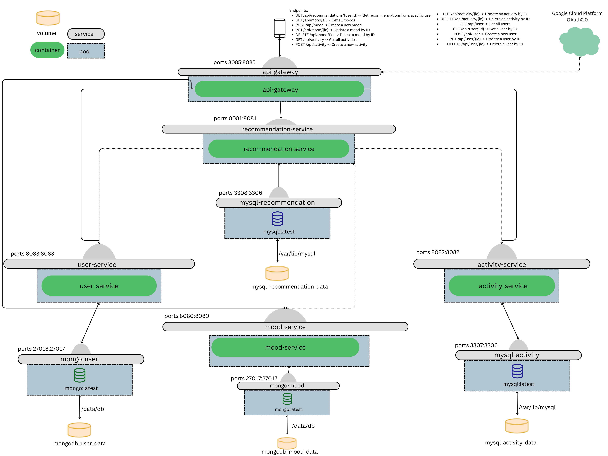

### Screenshots of Endpoints
All API endpoints were tested using Postman. Below are some example requests demonstrating the functionality:

- **Get Recommendations**: 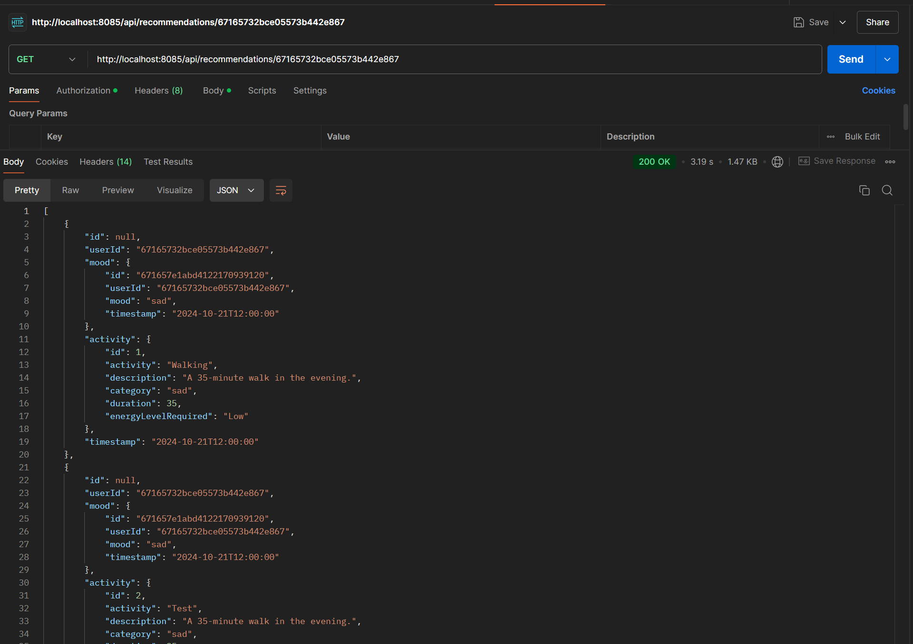
- **Authorization**: 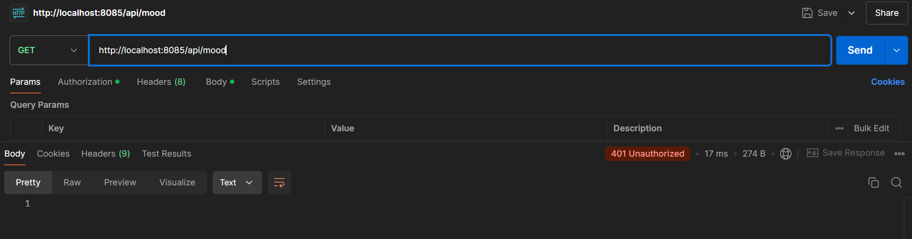
- **Frontend**: 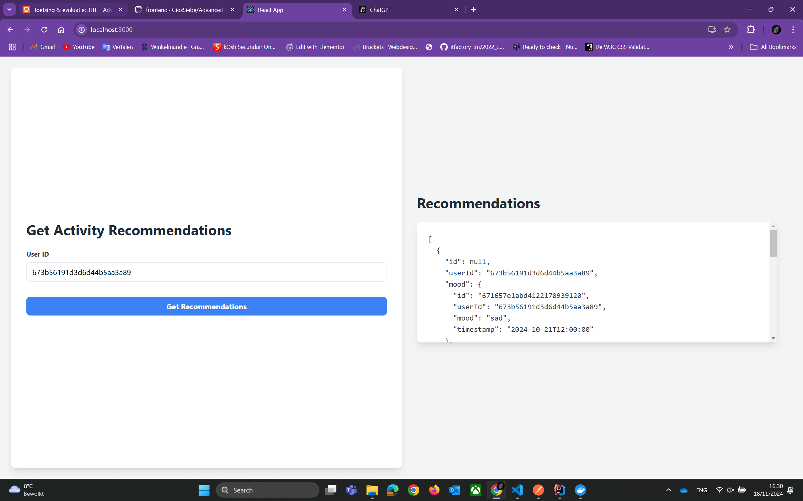
- **GET** `/api/user`: 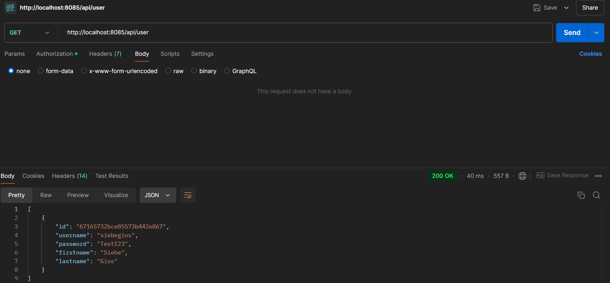
- **POST** `/api/user`: 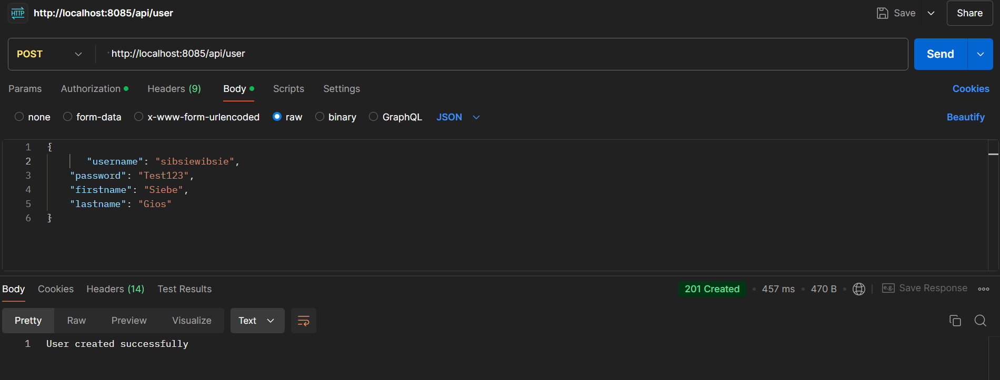
- **PUT** `/api/user/{id}`: 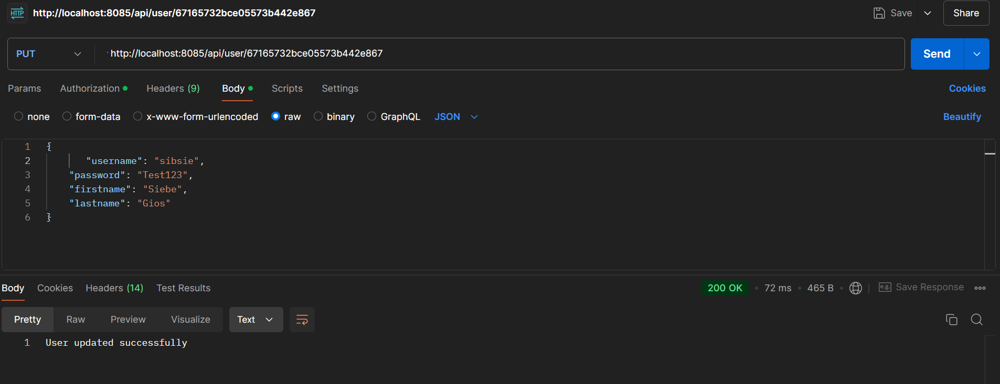
- **DELETE** `/api/user/{id}`: 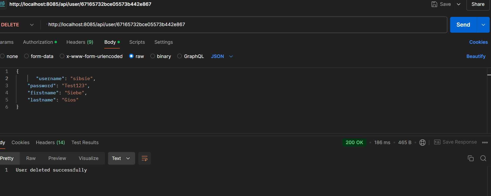
- **GET** `/api/mood`: 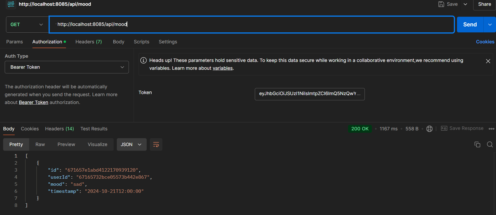
- **POST** `/api/mood`: 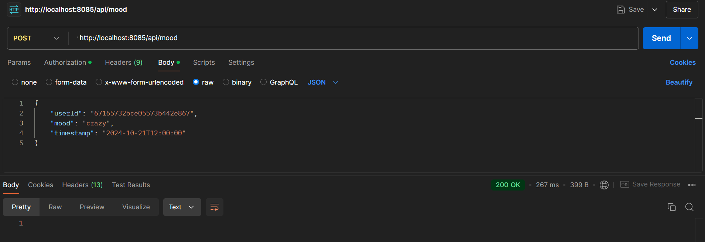
- **PUT** `/api/mood/{id}`: 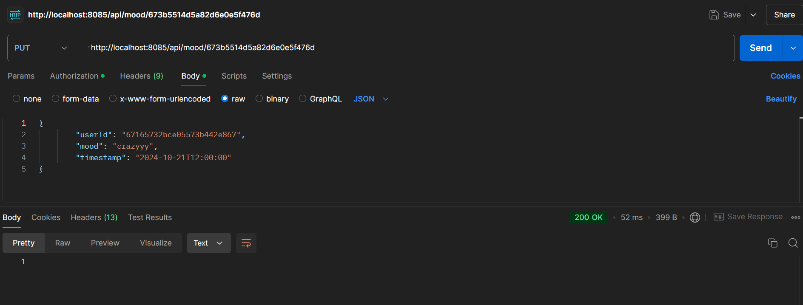
- **DELETE** `/api/mood/{id}`: 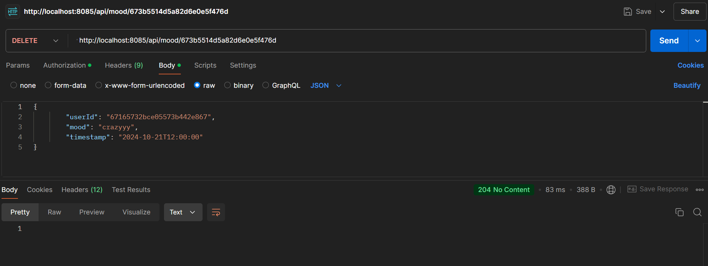
- **GET** `/api/acitivty`: 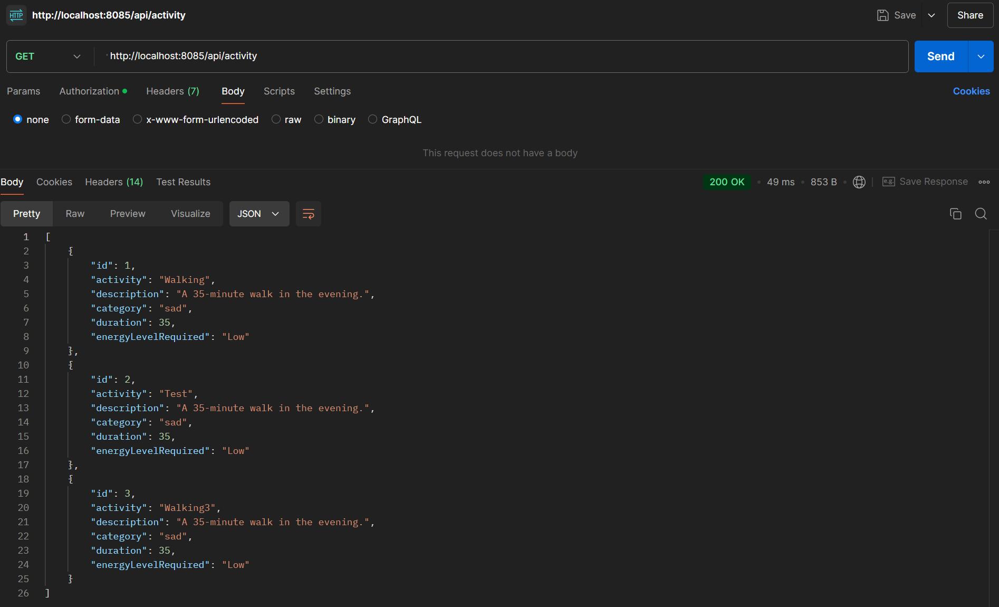
- **POST** `/api/acitivty`: 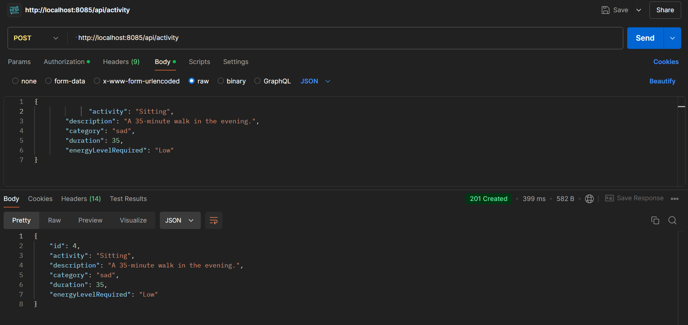
- **PUT** `/api/acitivty/{id}`:  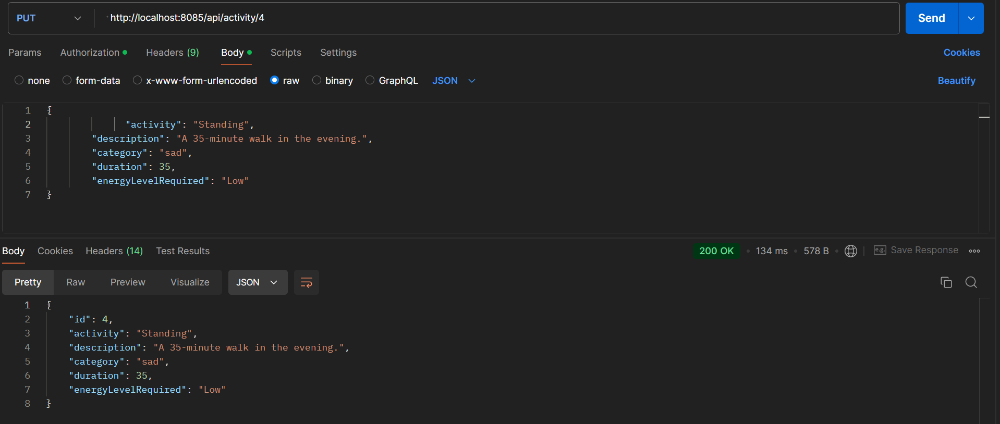
- **DELETE** `/api/acitivty/{id}`:  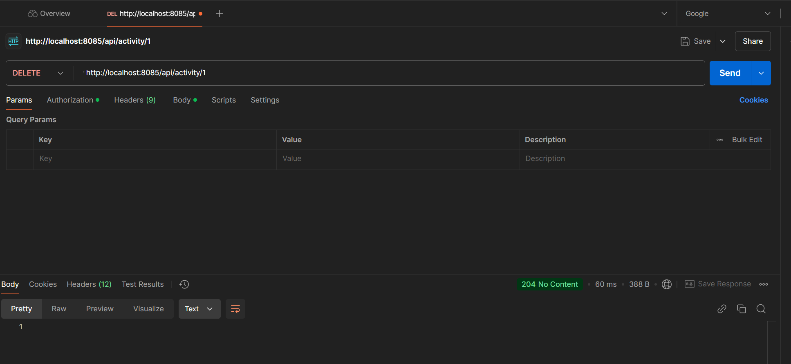

## Technical Choices

- **MongoDB**: Chosen for its flexibility in handling unstructured data, ideal for storing diverse mood entries and activities.
- **MySQL**: Used for structured data management, ensuring ACID compliance for user-related data.

## Additional Features

- **Frontend Application**: Developed a user-friendly interface that allows users to manage their moods and activities, seamlessly interacting with the backend. Looks cool and API call is working with CORS and runs in container through github actions. Output is still in json format, but can easily be something else.
- **Kubernetes**: Kubernetes .yml files to run the stack in Kubernetes. Runs in Kuberentes, but not fully functioning.

## Testing

All service classes include unit tests to verify the functionality of endpoints. Automated tests are run using GitHub Actions to ensure continuous integration and delivery.

## Lessons Learned

Through the development of this project, I gained valuable insights into microservices architecture, effective database management, and secure API development. The experience has enhanced my skills in creating scalable applications and managing complex interactions between services.

## Live Demo

A demo video showcasing the project’s structure, functionality, and frontend interaction is available here: [Demo Video](link-to-demo-video).

## Repository

The complete project code can be found on GitHub: [GitHub Repository](https://github.com/GiosSiebe/AdvancedProgrammingTopics).

## Conclusion

This project not only fulfills the academic requirements but also offers a meaningful application aimed at improving user engagement and mental well-being. The learnings and skills acquired during this project will undoubtedly aid in future software development endeavors.
